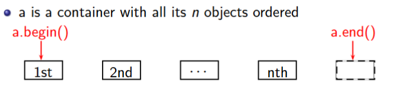
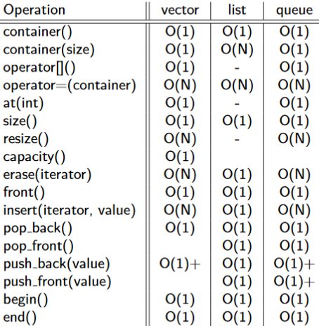

# UNSW COMP6771 (Advanced C++) Week 2
This week is about STL containers, iterators and algorithms

# I/O (Input / Output) in C++
```cpp
#include <iostream>
#include <fstream>

// input stream (read data)
int i;
std::ifstream fin{"data.in"};
while (fin >> i) {
  std::cout << i << "\n";
}
fin.close();

// output stream (output data)
std::ofstream fout{"data.out"};
fout << i;
fout.close();
```  
## I/O With error detection
```cpp
#include <iostream>
#include <fstream>

int main () {
  // Below line only works C++17
  if (auto in = std::ifstream{"data.in"}; in) { // attempts to open file, checks it was opened
    for (auto i = 0; in >> i;) { // reads in
      std::cout << i << '\n';
    }
    if (in.bad()) {
      std::cerr << "unrecoverable error (e.g. disk disconnected?)\n";
    } else if (not in.eof()) {
      std::cerr << "bad input: didn't read an int\n";
    }
  } // closes file automatically <-- no need to close manually!
  else {
    std::cerr << "unable to read data.in\n";
  }
}
```
## I/O with format
```cpp
#include <iostream>
#include <iomanip> // to use the setprecision manipulator

int main() {
  std::cout << 1331 << std::endl; // 1331
  std::cout << "In hex " << std::hex << 1331 << std::endl; // In hex 533
  std::cout << 1331.123456 << std::endl; // 1331.12
  std::cout.setf(std::ios::scientific, std::ios::floatfield);
  std::cout << 1331.123456 << std::endl; // 1.331123e+03
  std::cout << std::setprecision(3) << 1331.123456 << std::endl; // 1.331e+03
  std::cout << std::dec << 1331 << std::endl; // 1331
  std::cout.fill(’X’);
  std::cout.width(8);
  std::cout << 1331 << std::endl; // XXXX1331
  std::cout.setf(std::ios::left, std::ios::adjustfield);
  std::cout.width(8); 
  std::cout << 1331 << std::endl; // 1331XXXX
}
```

# Type conversion
- Implicit: Compiler-directed conversions
- Explicit: Programmer-specified conversions
```cpp
// Implicit type conversion
#include <iostream>

int main() {
  int age = 17;
  double agePrecise = age;
  std::cout << age;
}
```
## `static_cast`
```cpp
double pi = 3.14;
int piInteger1 = pi; // What happens here?
int piInteger2 = (int)pi; // C-style
int piInteger3 = static_cast<int>(pi); // C++ style

int x = 5, y = 2;
// Note how the order of operations is not immediately obvious with C-style casts
double slope = (double)x / y; // C-style
double slope = static_cast<double>(x) / y; // C++ style
```
### Why use `static_cast` over C-style cast?
C-style can mean more than `static_cast`. It also might mean `reinterpret_cast` or `const_cast`. The compiler tries each of them until it finds one that works. C-style cast might differs from what you expect and introduces potential bugs. Further, static_cast is a lot easier to search for or do search/replace on.  
Reference: https://stackoverflow.com/a/475831/9494810

### Choosing from `static_cast`, `dynamic_cast`, `const_cast`, `reinterpret_cast`, C-style cast (type)value, Function-style cast type(value)?
`static_cast` is preferred. `reinterpret_cast` is dangerous but useful when dealing with low level memory operations. C-style cast and Function-style cast should be avoided.  
This also triggers another dissimilar but interesting problem: using bracket `()` or curly bracket `{}` to call constructor. When there is only one variable, `()` can be dangerous as it might be interpreted as a C-style cast rather than calling constructor. But `{}` is guaranteed to call the constructor. Then `{}` should be used as it is safer.   
Reference: https://stackoverflow.com/a/332086/9494810

# Iterating through arrays in C++
```cpp
#include <array>
#include <iostream>

int main() {
  // C-style. Don't do this
  // int ages[3] = { 18, 19, 20 };
  // for (int i = 0; i < 3; ++i) {
  //   std::cout << ages[i] << "\n";
  // }

  // C++ style. This can be used like any other C++ container.
  // It has iterators, safe accesses, and it doesn't act like a pointer.
  std::array<int, 3> ages{ 18, 19, 20 };

  for (int i = 0; i < ages.size(); ++i) {
    std::cout << ages[i] << "\n";
  }
  for (auto it = ages.begin(); it != ages.end(); ++it) {
    std::cout << *it << "\n";
  }
  for (const auto& age : ages) {
    std::cout << age << "\n";
  }
}
```

# Function Templates
```cpp
template <typename T>
T Min(T a, T b) {
  return a < b ? a : b;
}

int main() {
  Min(1, 2); // uses int min(int, int);
  Min(1.1, 2.2); // double min(double, double);
}
```
The compiler will generate different codes for different given types. It runs faster because the generated codes are designed for the particular given type, but the size of codes will also be larger as there will be 50 different code instances of the templates for 50 different given types.

# STL: Standard Template Library
STL is an architecture and design philosophy for managing generic and abstract collections of data with algorithms
- All components of the STL are templates
- Containers store data, but don't know about algorithms
- Iterators are an API to access items within a container in a particular order, agnostic of the container used
  - Each container has its own iterator types
- Algorithms manipulate values referenced by iterators, but don't know about containers

## Iterators

- Iterator is an abstract notion of a pointer
- Iterators are types that abstract container data as a sequence of objects
- The glue between containers and algorithms
```cpp
#include <iostream>
#include <vector>
#include <string>

int main() {
  std::vector<std::string> names;
  for (auto iter = names.begin(); iter != names.end(); ++iter) {
    std::cout << *iter << "\n";
  }
  for (std::vector<std::string>::iterator iter = names.begin(); iter != names.end(); ++iter) {
    std::cout << *iter << "\n";
  }
}
```
- `a.begin()`: abstractly "points" to the first element
- `a.end()`: abstractly "points" to one past the last element, not an invalid iterator value, is something like rubbish
- If iter abstractly points to the k-th element, then:
  - `*p` is the object it abstractly points to
  - `++p` abstractly points to the (k + 1)-st element
### Iterators, Constness, Reverse

- `begin()`: first element
- `rbegin()`: last element
- `cbegin()`: first element, const,
- `crbegin()`: last element, const
- `end()`: after last element
- `rend()`: before first element
- `cend()`: after last element, const
- `crend()`: before first element, const
```cpp
#include <iostream>
#include <vector>

int main() {
  std::vector<int> ages;
  ages.push_back(18);
  ages.push_back(19);
  ages.push_back(20);

  // type of iter would be std::vector<int>::iterator
  for (auto iter = ages.begin(); iter != ages.end(); ++iter) {
    (*iter)++; // OK
  }

  // type of iter would be std::vector<int>::const_iterator
  for (auto iter = ages.cbegin(); iter != ages.cend(); ++iter) {
    //(*iter)++; // NOT OK because it is const
  }

  // type of iter would be std::vector<int>::const_iterator
  for (auto iter = ages.rbegin(); iter != ages.rend(); ++iter) {
    std::cout << *iter << "\n"; // prints 20, 19, 18
  }

  // Can also use crstart and crend
}
```
### Iterator Categories
Input/Output -> Forward -> Bidirectional -> Random (more powerful)
#### Algorithm requires certain kinds of iterators
- input: find(), equal()
- output: copy()
- forward: replace(), binary_search()
- bi-directional: reverse()
- random: sort()
#### Container's iterator falls into a certain category
- forward: forward_list
- bi-directional: map, list
- random: vector, deque

Stack, queue are container adapters, and do not have iterators
#### Other Iterators: streams
```cpp
#include <fstream>
#include <iostream>
#include <iterator>

int main() {
  std::ifstream in("data.in");

  std::istream_iterator<int>begin(in);
  std::istream_iterator<int> end;
  std::cout << *begin++ << "\n"; // read the first int

  ++begin; // skip the 2nd int
  std::cout << *begin++ << "\n"; // read the third int
  while (begin != end) {
    std::cout << *begin++ << "\n"; // read and print the rest
  }
}
```

## STL: Containers
STL containers are abstractions of common data structures

*https://en.cppreference.com/w/cpp/container*
### Sequential Containers
- Elements have specific order controlled by programmer
- Class templates
```cpp
#include <iostream>
#include <vector>

// Begin with numbers 1, 2, 3 in the list already
int main() {
  // In C++17 we can omit the int if the compiler can determine the type.
  std::vector<int> numbers {1, 2, 3};
  int input;
  while (std::cin >> input) {
    numbers.push_back(input);
  }
  std::cout << "1st element: " << numbers.at(0) << "\n"; // slower, safer
  std::cout << "2nd element: " << numbers[1] << "\n"; // faster, less safe
  std::cout << "Max size before realloc: " << numbers.capacity() << "\n";
  for (int n : numbers) {
    std::cout << n << "n"
  }
}
```
- `std::vector`: Dynamically sized array
- `std::list`: Doubly linked list
- `std::forward_list`: Singly linked list
- `std::deque`: <vector> with fast operations for element at beginning
- `std::array`: C-style array wrapper
### Associative Containers
A value type is accessed through a second data type, the key.
```cpp
#include <iostream>
#include <map>
#include <string>

int main() {
  std::map<std::string, double> m;
  // The insert function takes in a key-value pair.
  std::pair<std::string, double> p1{"bat", 14.75};
  m.insert(p1);
  // The compiler will automatically construct values as
  // required when it knows the required type.
  m.insert({"cat", 10.157});
  // This is the preferred way of using a map
  m.emplace("cat", 10.157);

  // This is very dangerous, and one of the most common causes of mistakes in C++.
  std::cout << m["bat"] << '\n';

  auto it = m.find("bat"); // Iterator to bat if present, otherwise m.end()

  // This is a great example of when to use auto, but we want to show you what type it is.
  for (const std::pair<const std::string, double>& kv : m) {
    std::cout << kv.first << ' ' << kv.second << '\n';
  }
}
```
- map<T>
  - log(n) for most operations, probably stored as a red-black tree
  - Ordered by key value (requires key to be comparable with <)
  - Iterators will iterate through in order of key, not by insertion time
- unordered_map<T>
  - O(1) for most operations
  - Stored as a hash table (requires keys to be hashable)
  - Iterators will iterate through in an arbitrary, undefined order
- set<T>
  - Search, removal, insertion have log(n) complexity
  - Contains sorted set of unique objects of type Key